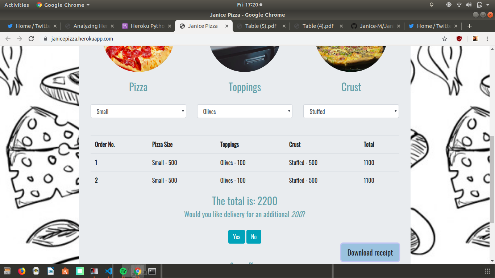
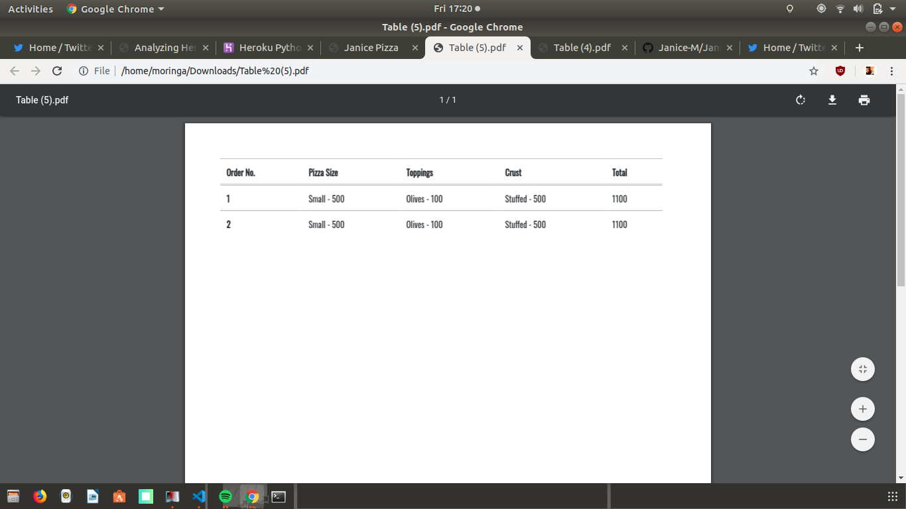

# Janice Pizza

This is a test application for a web  based dashboard that is able to set the products/services, their pricing and also show live reports of transactions and create a downloadable receipt

## The Dashboard

## The Receipt 
 This a pdf version of the receipt 

## Getting Started/Setup

* `git clone https://github.com/Janice-M/fireNation.git`

##### Create a virtuual
* Creating Virtualenv - unlimited virtual
* `sudo apt-get install python3-pip`
* ` pip3 install virtualenv`
* `virtualenv venv` (you can call it venv or anything you like)
* `source venv/bin/activate`

 Let virtual remain activated and then in virtual :

#### Install django 

* run `pip install django==2.0.7`
* Then run shell  by using `python3.6`
* `import django` in shell to confrim the set up was successful

#### Install dependencies 

`pip3 install -r requirements`

### Environment requirements 

* SECRET_KEY= added by default
* DEBUG= set to false in production
* DB_USER= database user of choice
* DB_PASSWORD= database of choice
* DB_HOST="127.0.0.1" on local
* MODE= dev or prod , set to prod during production
* ALLOWED_HOSTS='.localhost', '.herokuapp.com', '.127.0.0.1' 

## Running the tests

Run tests by running the following :

There are no tests as there are no models as at not

### Break down into end to end tests

Not applicable

### And coding style tests

The app does not need coding style tests according to its current scope

## Database Migration

Migrate using:

`python manage.py migrate `

## Running The Server on Your Local Host
`python manage.py runserver`

## Built With

* Django - Python Framework
* jQuery- Javascript
* HTML5
* Bootstrap 4

## Deployment 

Please read [Deploy to Heroku :)](hhttps://simpleisbetterthancomplex.com/tutorial/2016/08/09/how-to-deploy-django-applications-on-heroku.html) for details on our deployment of this app

## Authors

* **GreyWorm-Janice** - *Initial work* - [Janice 2019](https://github.com/Janice-M)

## License

This project is licensed under the MIT License - see the [LICENSE.md](LICENSE.md) file for details

